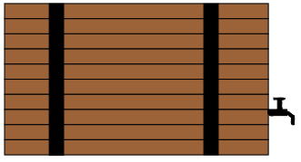

# Cask



A library for building asynchronous and event-driving programs in C++ using concepts
stolen from RX and functional programming. It exposes the `Task` and `Observable` types
for modeling these types of programs. These types are lazily-evaluated, high-performance,
asynchronous, composable, and testable.

Programs built using cask are naturally cooperative - running on an event loop specifically
built for cask. They are also easy to reason about with concepts like backpressure and
data immutability being considered from the beginning. Rather than composing asychronous
programs using callbacks `Task` and `Observable` provide monadic operations for composing them
such as `map`, `flatMap`, `filter`, and all of their friends.

Because of the underlying functional programming ideas implemented in cask - programs built
using it are also fundamentally testable without any complex frameworks. Tasks and Observables
are easy to dependency inject, easy to run in a test bench, and are _lazy_  - so they don't
run until your test bench is good and ready.

## Adding Cask to your Project

Cask is _almost_ entirely a header-only template library. There are only a few source files
that need to be compiled into your project. If you are using meson, just include this project
as a subproject in your own build. Otherwise - add the `include` folder to your include path
and build everything in the `src` folder.

Cask requires C++17 and is tested to compile on both clang and GCC on both Linux and Mac. It
is also in real usage on embedded MIPS and Arm targets compiled using GCC. We try to stick
to the standard C++17 library - so compiling for other targets should "just work" or work with
only minor adjustments. Please raise issues if you see something needed to make cask compile
for your target.

## Using Cask

Once cask is pulled into your project - just grab the header for the tool you would like to
use. For example:

```cpp
#include <iostream>
#include "cask/Task.hpp"
#include "cask/Observable.hpp"

using cask::Task;
using cask::Scheduler;

int main(int argc, char** argv) {
   return Task<int>::eval([]{
         std::cout << "Hello World" << std::endl;
         return 0;
      })
      .run(Scheduler::global())
      ->await();
}

```

## Working with This Repository

### Installing Host Build Dependencies

This project needs meson, ninja, and a sane C/C++ toolchain installed on the host.
On Ubuntu 20.04 these most of these can be obtained from the package manager. To
get the whole kitchen sink (including GCC and Clang):

```bash
sudo apt install ninja-build clang build-essential python3-pip gcovr
```

Meson itself is best installed by pulling from pip directly.

```bash
sudo python3 -m pip install meson==0.57.0
```

Finally you can generate the same build environments used by CI with the provided
`regenerate_env.sh` script.

```bash
# Setup an environment using GCC with debug symbols, optimizations disabled, various
# santizers, and code coverage.
./regenerate_env.sh debug

# Setup an environment using GCC in a more realistic setup - no debug symbols
# and optimizations are enabled
./regenerate_env.sh release

# Setup an environment using Clang in a more realistic setup - no debug symbols
# and optimizations are enabled
./regenerate_env.sh clang
```

### Building the Code

After running all of the build steps a selection of `build_*` folders should be available
on your system - one for each target that we build and test for. Within each of these
folders you can run `meson test` to compile the code for that target and run all of the
unit tests.

For example, to run tests for the debug build.

```bash
meson test -C build_debug
```

## Inspiration for this Project

The ideas implemented in this project are not new. There are a great many projects working
to expand the ideas of reactive and functional programming out in the world but these are
some that I've used that have really influenced this project greatly. Go take a look at
them - they really are doing some amazing things.

- [The ReactiveX Project](http://reactivex.io/)
- [Monix](https://monix.io/)
- [Cats Effect](https://typelevel.org/cats-effect/)
- [The Haskell Programming Language](https://www.haskell.org/)

## License

Cask is licensed under the terms of the Boost Software License Version 1.0. You can
read the exact text of the license [here](LICENSE_1_0.txt).
